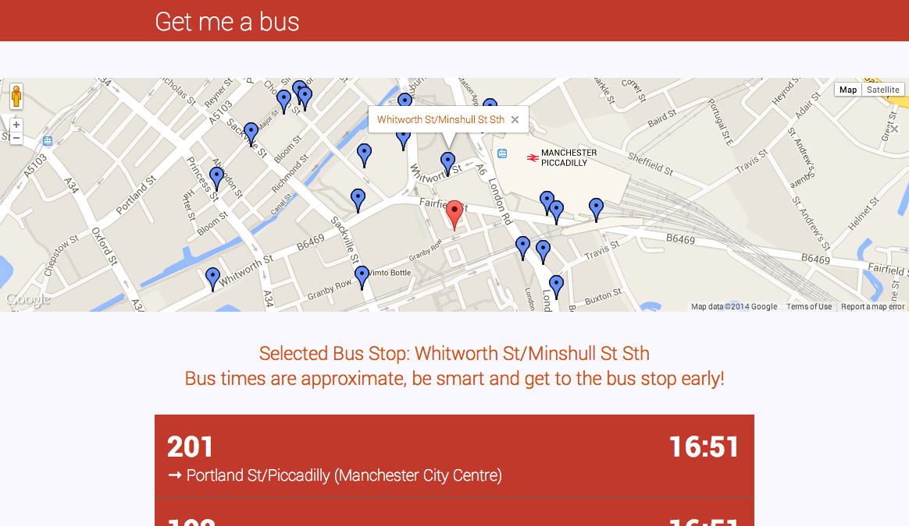

# Work

##[Unify](http://danwilson.co/unify)

Unify is a super simple application built using [Emberjs](http://emberjs.com). It started out as a vanilla JavaScript application I built to learn JavaScript but it needed a remake so I built it in Emberjs.

<a href="http://danwilson.co/unify" class="view--site--btn">View Site</a>

##[Getmeabus.com](http://getmeabus.com)

Getmeabus.com is a site me and a [friend](http://syeefkarim.com) worked on during our final year at university. We both regulary uses buses but there was no easy way to check bus times, so we set out to fix that. It's built with the [Google Maps API](https://developers.google.com/maps/) and the [Transport API](http://transportapi.com/).

<a href="http://getmeabus.com" class="view--site--btn">View Site</a>

##[Lewishancock.com](http://lewishancock.com)

Lewis Hancock has been a good friend of mine for a long time. His first website was the first website that I had ever made and launch. This was back in college and when he reached out to me in the summer to give it a face lift, I had to oblige.

<a href="http://lewishancock.com" class="view--site--btn">View Site</a>

