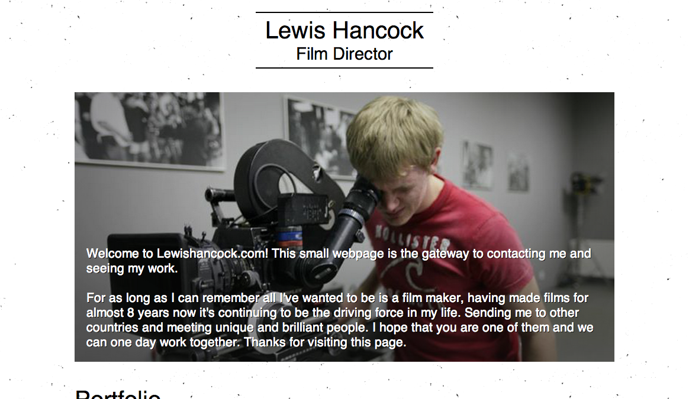

# Work

##[Sean](http://seants.herokuapp.com)

Sean was a quick project I threw together to help me keep on top of my timesheets at work. There's a neat feature that times your jobs for you and rounds them to the nearest 15 minute. Sean is built using [Flask](http://flask.pocoo.org) and used the [Foundation](http://foundation.zurb.com) CSS framework. Sean is free for anyone to use.

<a href="http://seants.herokuapp.com" class="view--site--btn">View Site</a>

##[Recur](https://recur.herokuapp.com/)

Recur is a web applciation for monitoring your fitness progress I built for my final year progject at university. It can monitor your current and goal weight, your fitness goals, and your fitness activity. With all of this information recur will be able to show you how well you are doing and keep you motivated! Recur was builtusing Ruby on Rails and hosted on [Heroku](http://heroku.com).

<a href="https://recur.herokuapp.com/" class="view--site--btn">View Site</a>

##[Unify](http://danwilson.co/unify)

Unify is a super simple application built using [Emberjs](http://emberjs.com). It started out as a vanilla JavaScript application I built to learn JavaScript but it needed a remake so I built it in Emberjs.

<a href="http://danwilson.co/unify" class="view--site--btn">View Site</a>

##[Getmeabus.com](http://getmeabus.com)

Getmeabus.com is a site me and a [friend](http://syeefkarim.com) worked on during our final year at university. We both regulary uses buses but there was no easy way to check bus times, so we set out to fix that. It's built with the [Google Maps API](https://developers.google.com/maps/) and the [Transport API](http://transportapi.com/).

<a href="http://getmeabus.com" class="view--site--btn">View Site</a>

##[Lewishancock.com](http://lewishancock.com)

Lewis Hancock has been a good friend of mine for a long time. His first website was the first website that I had ever made and launch. This was back in college and when he reached out to me in the summer to give it a face lift, I had to oblige.

<a href="http://lewishancock.com" class="view--site--btn">View Site</a>

## University work
Throughout University, I've had to complete a number of assignments. These assignments are too specific to be hosted on their own, so instead I put all the code up on [GitHub](http://github.com/wilsonand1). So here they all are: [PHP Web Calendar](https://github.com/wilsonand1/web-calendar), [C# Artist AVL Tree](https://github.com/wilsonand1/Artist-AVL-Tree), [Java Employee Records](https://github.com/wilsonand1/Employee-Record)
